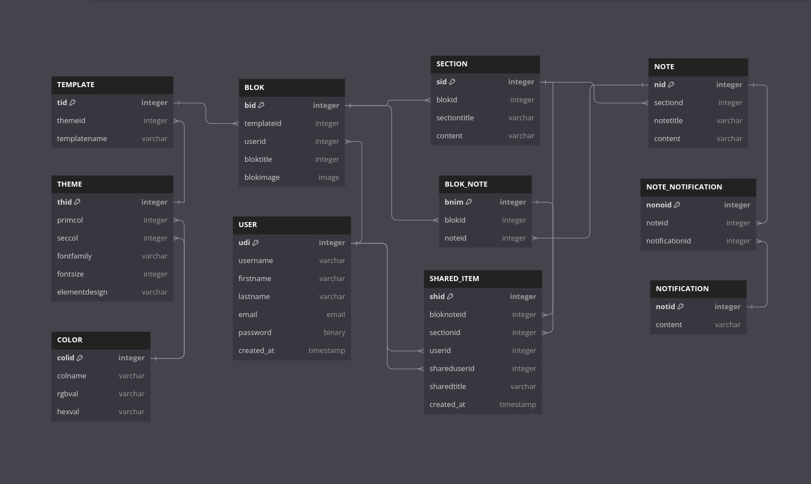

## 📝 About

<div align="justify">
Notes is a web app for creating, deploying and sharing notes. Easly manage and organize
all your notes so you can share them with other Notes partners.
</div>

## ⚙️ Features

### Guests 👥

```
+_____________________________+
| Blok   | Notes  |    Editor   |
|_____________________________|
|        |        |                |
|        |        |                |
|        |        |                |
.        .        .                .
.        .        .                .
```

- limited to one blok
- limited to the duration of the session
- print and export (PDF) blok
- predefined application theme
- use all editor features
    - basic text manipulation functions
    - font formatting, lists, styles, syntax checking
    - adding tables, files, images, links, symbols, emoticons and audio


### User 👤

```
+_____________________________+
|       Blok       |               |
|_____________________________|
| Section | Notes  |  Editor    |
|_____________________________|
|        |        |                |
|        |        |                |
|        |        |                |
.        .        .                .
.        .        .                .
```

- sharing, printing and exporting (PDF) bloks
    - sharing combination of notes
    - linking notes to accounts
    - setting view/edit permissions
- customizing bloks, sections and notes
    - setting colors or icons for identification
- offered selection of templates
- saving configurations (creating reusable templates)
- search, filter and sort bloks, sections and notes
- customizable notifications

### User Story 🗣️

<div align="justify">
As a hotel manager, I want to organize guest information and hotel operations into
categories and subcategories so that we can efficiently manage our services and
enhance the guest experience. For example, I want to group information under main
categories like "Reservations" or "Guest Services," and break them down further, such
as "VIP Guests" under "Reservations" or "Room Maintenance" under "Housekeeping."  

I’d like to view these categories in a tree-like structure where staff can easily
expand or collapse sections. I want to be able to add, rename, move, or delete
categories with ease and assign colors or icons to them for quick identification.
Additionally, I want to link guest preferences to their profiles to ensure that all
staff members have access to relevant information.

The ability to search, filter, and sort through information is crucial, as well as 
organizing templates for common requests that automatically create subcategories.
When generating reports or analyzing data, I want the structure to be preserved.

In short, this system will help us manage our hotel operations efficiently, making
it easier to provide exceptional service to our guests.
</div>

## 🗄️ Database

<div align="justify">

<div>

## 📌 Tasks

1. README ⌛️

Boris:  
- (README) List out features for Guests and Users ⌛️
- (README) Create an example Database ⌛️

Silvestar:  
- (personal) Set-up working environment (IntelliJ IDEA and Git) ⌛️
- (README) Write an Example User Story ⌛️

## 🎓 Authors

Developed by [*chora7*](https://github.com/chora7) and [*salveta96*](https://github.com/salveta96).

## ⚖️  License

For more information check the [LICENSE](LICENSE) file.
