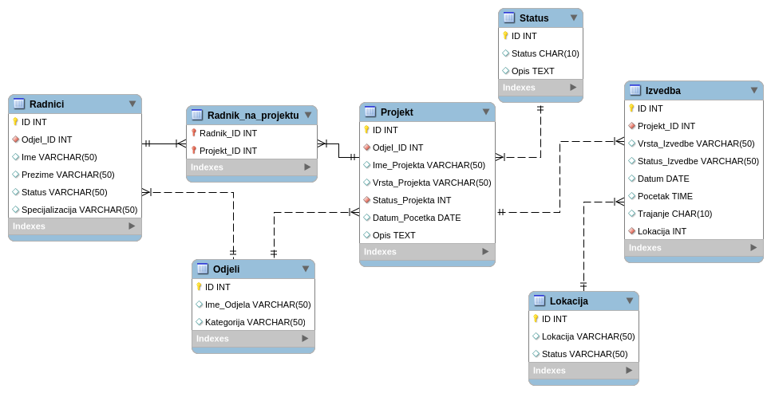

## 📝 O aplikaciji

Bilo da je riječ o lutkarskoj predstavi ili baletu, Kazalište vam pruža interaktivno
web sučelje za upravljanje kazališnim projektima. S lakoćom upravljajte sudionicima i
efikasno dijelite informacije kako bi vaše izvedbe protekle u najboljem redu.

## ⚙️ Značajke

Voditelj projekta:  
<!-- Projekt -->
- objava projekta / upravljanje vidljivosti podataka  
- dodavanje sudionika u projekat / dodjela projekata sudionicima  
- generiranje izvješća za javnost / pregled projekta u vidu smislene cjeline  
<!-- Projekt-Radnici -->
- raspored sudionika po odjelima / dodjela projektnih odjela sudionicima  
- određivanje uloge / specijalizacija sudionika  
- pregled i promjena statusa sudionika  
<!-- Status -->
- upravljanje statusom projekta / uvid i izmjena statusnih detalja  
<!-- Odjeli -->
- kategoriziranje odjela / grupiranje sudionika  
<!-- Izvedba -->
- odredba izvedbe i uvid u tok izvedbe / trajanje i vrsta izvedbe  
- datiranje pojedinih epoha projekta / datiranje zasebnih izvedbi  
<!-- Lokacija -->
- provjera dostupnosti i unos lokacija / određivanje lokacije izvedbe  
- mogućnost proizvoljnog dijeljenja pjedinih informacija unutar tima  
- mogućnost integracije s bazama podataka računovodstvom  

Sudionici:  
- obavijesti o dodjeli projekta / informiranje voditelja o učešću  
- postavljanje specijalizacije i statusa / dostupnost i područje interesa  
- pregled aktivnih kazališnih projekata / upit za učešćem  
- promjena statusa i aktivnosti / omogućeno datiranje bilješki  
- filtriranje dostupnih uloga / gradnja iskustva sukladno izvedbama  
- ukupno vrijeme učešća / dizanje statusa sukladno aktivnosti  

### User Story 🗣️

  "U našem kazalištu svaki projekt uključuje mnogo ljudi, prostora i termina – od tehnike i scene, do umjetničkih timova. Sve to zahtijeva savršenu usklađenost i praćenje, što ponekad postane kaotično. Zato nam treba aplikacija koja će omogućiti da sve imamo na jednom mjestu.

Uz nju, mogli bismo jednostavno dodijeliti radnike zadacima, rezervirati prostore prema potrebama i pratiti termine proba i izvedbi. Tako bi svi imali jasan pregled i ažurirane informacije, što bi našim projektima donijelo više reda i manje stresa."

## 🗄️ Model baze

  

## 📌 Zadaci

## 🎓 Autori

Razvijeno od strane [*Maplewood7*](https://github.com/Maplewood7), [*chora7*](https://github.com/chora7) i [*salveta96*](https://github.com/salveta96).

## ⚖️  Licenca

Za više informacija posjetite [LICENSE](LICENSE) datoteku.
