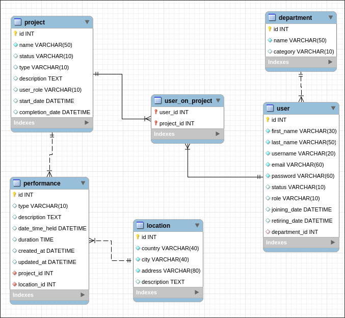

## 📝 About

Whether if it’s a drama or a ballet, the Theater app offers you an interactive web interface
for managing theater projects. Easily manage participants and efficiently share information
to ensure your performances run smoothly. 

## ⚙️ Features

Administration:
- project publication and data visibility management
- adding participants to the project
- assigning projects to participants
- assigning participants to departments
- determining the role and specialization of participants
- reviewing and changing participant status
- managing project status and viewing and changing status details
- categorizing departments and grouping participants
- determining performances and viewing performance status
- marking individual project stages
- checking availability and entering locations
- possibility of arbitrary sharing of individual information within the team
- possibility of integration with accounting databases

Employees:
- project assignment notifications
- overview of active theater projects
- insight into the status and availability of locations 

### User Story 🗣️

"In our theater, each project involves many people, spaces, and schedules from technical
and stage crews to artistic teams. All of this requires perfect coordination and
tracking, which can sometimes become chaotic. That’s why we need an application that
allows us to have everything in one place.  

With it, we could easily assign workers to tasks, reserve places as needed, and track
rehearsal and performance schedules. This way, everyone would have a clear overview
and up-to-date information, bringing more order and less stress to our projects.

## 🗄️ Database Model

  

## 📌 To-do

- [x] Translate project and database to english
- [x] Add timestamps
- [x] Set up SpringBoot project and test Migrations
- [x] Naming convention for the database
- [x] mysql Docker database
- [x] pull instructions for Docker database
- [x] Write Dockerfile and compose.yml
- [x] user register (save to database)
- user management (authentication and UI)
- announcing projects and adding performances (expanding controllers)
- adding users to departments
- adding locations
- listing all tables

## 🎓 Authors

Developed by [*Maplewood7*](https://github.com/Maplewood7), [*chora7*](https://github.com/chora7) and [*salveta96*](https://github.com/salveta96).

## ⚖️  License

Teatar is MIT-licensed. For more information check the [LICENSE](LICENSE) file.
